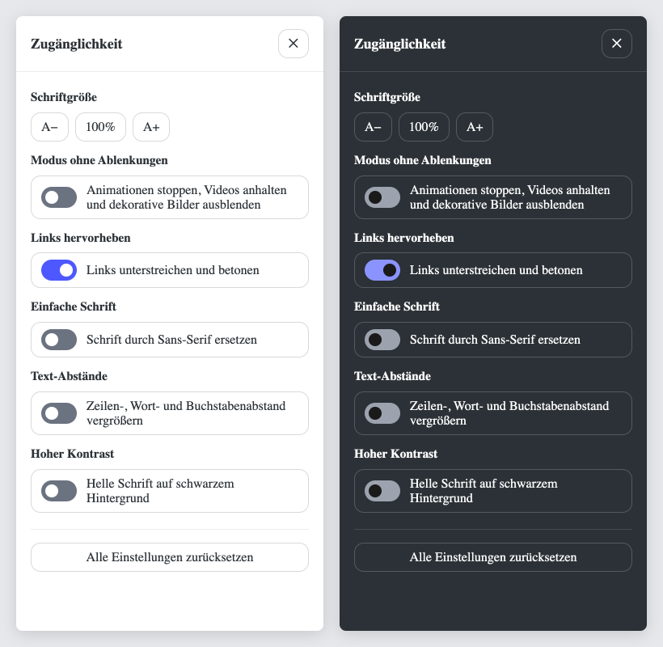

# Contao A11y Widget

Ein barrierearmes Accessibility Widget als Frontend-Modul für Contao 5: ein schwebender Button öffnet ein Panel, in dem Besucherinnen und Besucher die Darstellung der Seite an ihre Bedürfnisse anpassen.



## Funktionen

**Einstellungen für Besucher**

- **Schriftgröße** von 70 % bis 200 % – skaliert relativ zur Schriftgröße des Themes
- **Modus ohne Ablenkungen** – stoppt Animationen, hält Autoplay-Videos an und blendet dekorative Bilder (`alt=""`) aus
- **Links hervorheben** – unterstrichen und fett
- **Einfache Schrift** – systemeigene Sans-Serif-Schrift
- **Text-Abstände** – Zeilen-, Wort- und Buchstabenabstand nach WCAG 1.4.12
- **Hoher Kontrast** – helle Schrift auf Schwarz, Links gelb
- **Alle zurücksetzen**

Die Einstellungen gelten für die ganze Website, werden im Browser gespeichert (`localStorage`) und schon vor dem ersten Rendern angewendet – die Seite blitzt beim Laden nicht auf.

**Das Widget selbst ist barrierefrei**

- natives `<dialog>`: Fokus bleibt im Panel, Esc und Klick daneben schließen, danach springt der Fokus zurück
- echte Buttons und Schalter mit sichtbarem Fokusrahmen, Kontraste nach WCAG 1.4.11
- Screenreader-Ansagen bei Änderungen, sprechende Beschriftungen
- berücksichtigt `prefers-reduced-motion` und das Windows-Kontrastdesign (`forced-colors`)

**Für Redakteure und Entwickler**

- alle Texte im Backend anpassbar, Standardtexte auf Deutsch und Englisch (je nach Sprache der Seite)
- jede Option einzeln ein- und ausblendbar
- Position unten rechts oder unten links
- Farbschema hell, dunkel oder automatisch nach Systemeinstellung
- eigene Akzentfarbe – die Schriftfarbe darauf wird automatisch kontrastreich gewählt
- Farben als CSS-Variablen überschreibbar

## Voraussetzungen

- Contao 5.3 oder neuer
- PHP 8.1 oder neuer

## Installation

Über den Contao Manager nach `s-punkt-online/contao-a11y-widget` suchen oder per Composer:

```bash
composer require s-punkt-online/contao-a11y-widget
```

Anschließend die Datenbank aktualisieren:

```bash
vendor/bin/contao-console contao:migrate
```

## Verwendung

1. Im Backend unter **Themes → Frontend-Module** ein neues Modul vom Typ **Accessibility Widget** anlegen.
2. Optionen, Darstellung und Texte einstellen. Leere Textfelder verwenden den Standardtext, der im Feld als Platzhalter angezeigt wird.
3. Das Modul im **Seitenlayout** einbinden (z. B. in der Fußzeile). Die Position im Layout spielt keine Rolle, der Button wird immer fest in der gewählten Ecke angezeigt.

## Backend-Optionen

| Bereich | Einstellung |
|---|---|
| Allgemein | Panel-Titel, Beschriftungen von Öffnen-, Schließen- und Zurücksetzen-Button |
| Darstellung | Position (unten rechts / unten links), Farbschema (hell / dunkel / automatisch), Akzentfarbe |
| Schriftgröße | ein-/ausblenden, Überschrift, Screenreader-Texte der drei Buttons |
| Widget-Optionen | je Modus ein-/ausblenden, Überschrift und Schaltertext |

## Anpassen

### Farben

Alle Farben sind CSS-Variablen am Element `.a11y-widget` und lassen sich im eigenen Theme-CSS überschreiben:

```css
.a11y-widget {
    --a11y-fab-bg: #c00;            /* runder Button */
    --a11y-fab-text: #fff;
    --a11y-accent: #c00;            /* aktive Schalter */
    --a11y-accent-contrast: #fff;   /* Knopf auf aktivem Schalter */
    --a11y-bg: #fff;                /* Panel */
    --a11y-text: #2b3136;
    --a11y-border: rgba(0, 0, 0, 0.15);
    --a11y-divider: rgba(0, 0, 0, 0.08);
    --a11y-track: #6b7280;          /* inaktive Schalter */
    --a11y-knob: #fff;
    --a11y-focus: #ffd54f;          /* Fokusrahmen innen */
    --a11y-focus-contrast: #1a1a1a; /* Fokusrahmen außen */
}
```

Das dunkle Farbschema greift bei der Backend-Einstellung „Dunkel“, bei „Automatisch“ mit dunkler Systemeinstellung sowie – wie bisher – wenn das Theme `body.dark-mode` setzt.

### Auf Einstellungen reagieren

Aktive Einstellungen stehen als Klassen an `<html>` und `<body>` und können im Theme-CSS genutzt werden:

| Klasse | Einstellung |
|---|---|
| `a11y-reader-mode` | Modus ohne Ablenkungen |
| `a11y-highlight-links` | Links hervorheben |
| `a11y-sans` | Einfache Schrift |
| `a11y-text-spacing` | Text-Abstände |
| `a11y-high-contrast` | Hoher Kontrast |

Die gewählte Schriftgröße steht zusätzlich als `--a11y-font-scale` (z. B. `120%`) an `<html>`.

Elemente mit dem Attribut `data-decorative` werden im Modus ohne Ablenkungen ebenfalls ausgeblendet.

### Template

Das Markup liegt im Template `mod_a11y_widget.html5` und kann wie gewohnt über **Templates** oder das Feld **Individuelles Template** angepasst werden. Das JavaScript erkennt die Elemente an ihren `data-a11y-*`-Attributen. Angepasste Templates aus Version 1.0 (mit `<aside>`-Panel) funktionieren weiterhin.

## Hinweise

- Die Schriftgröße wirkt auf alles, was im Theme in `rem` oder `em` angegeben ist. Feste Pixelwerte werden nicht skaliert.
- Der Modus ohne Ablenkungen kann Karussells, die per JavaScript weiterschalten, nicht anhalten.
- Das Widget ersetzt keine barrierefreie Umsetzung der Website selbst, sondern ergänzt sie.

## Update

Siehe [CHANGELOG.md](CHANGELOG.md). Nach jedem Update `contao:migrate` ausführen.

## Lizenz

MIT – siehe [LICENSE](LICENSE).
